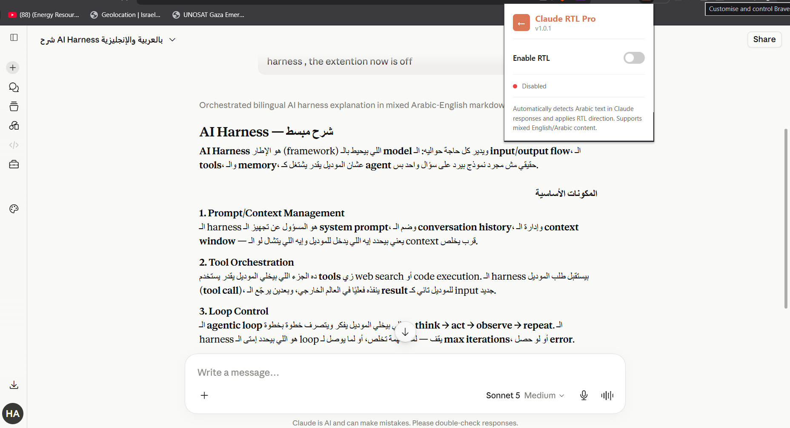
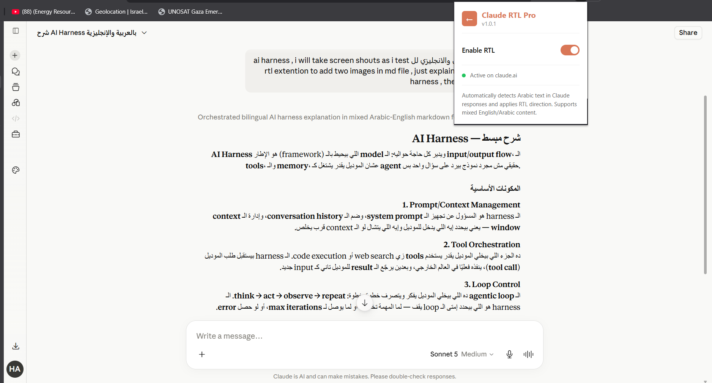

# 🌟 Claude RTL Pro Extension

Local Web extension that fixes RTLtext direction for mixed Arabic-English responses on claude.ai

A smart, lightweight browser extension designed for Arab developers and bilingual users to seamlessly support Arabic text in Claude.ai without breaking Markdown or Code blocks!

## 📑 Table of Contents
- [Why Claude RTL Pro?](#-why-claude-rtl-pro)
- [Key Features](#-key-features)
- [Screenshots](#-screenshots)
- [How to Install](#️-how-to-install)
- [Roadmap](#️-roadmap)
- [Contributing](#-contributing)
- [License](#-license)

## 🚀 Why Claude RTL Pro?

You might be wondering: "Why build a custom Chrome extension when there are tons of generic RTL (Right-to-Left) extensions out there?"

The truth is, generic RTL extensions often break modern web apps. They apply a blind RTL direction to the entire page, which ruins UI layouts and, worst of all, completely breaks code formatting.

I built Claude RTL Pro to solve these exact pain points for Arabic-speaking developers and users on Claude.ai. Here is what makes it completely different from anything else:

## ✨ Key Features

- 🛡️ **Code & Math Protection**: Generic extensions ruin code snippets if they detect a single Arabic comment inside them. Claude RTL Pro is built with smart selectors—it actively detects and ignores `<pre>`, `<code>`, and `.katex` blocks. Your code remains perfectly LTR (Left-to-Right), while the textual explanation around it switches to RTL.
- 🧠 **Granular Mixed Content Handling**: We often mix English and Arabic in prompts. Instead of flipping the entire chat box, this extension inspects the text paragraph by paragraph. It cleanly separates the content, applying RTL only to the specific sentences containing Arabic characters (using precise Regular Expressions).
- ⚡ **Live Streaming Support (MutationObserver)**: Claude streams its responses token by token. Claude RTL Pro uses a highly optimized `MutationObserver` to flip the text direction in real-time as the Arabic characters are being generated on the screen—no weird jumping or waiting for the message to finish.
- 🔒 **100% Privacy & Local Execution**: It operates completely on the client-side using Vanilla JavaScript. No data collection, no external servers, just clean, native DOM manipulation happening locally on your browser.
- 🌐 **Cross-Browser Compatibility**: Works perfectly on any Chromium-based browser (Google Chrome, Brave, Microsoft Edge, Opera, Vivaldi).

## 📸 Screenshots

**Before (Broken RTL)**

**After (Claude RTL Pro)**

## 🛠️ How to Install

Since this extension isn't on the Web Store yet, you can load it locally on your machine in seconds:

1. **Download the code**: Clone this repository or download the code as a `ZIP` file and extract it.
2. **Open Extensions Page**:
   - On Chrome / Brave: Go to `chrome://extensions/`
3. **Enable Developer Mode**: Turn on the Developer mode toggle in the top right corner.
4. **Load the Extension**: Click the Load unpacked button and select the extracted folder.
5. **Start Chatting!** Open [Claude.ai](https://claude.ai/) and experience seamless Arabic and English integration.

## 🗺️ Roadmap

- [ ] Publish to Chrome Web Store
- [ ] Add settings popup (toggle on/off per chat)
- [ ] Support Firefox (WebExtensions API)
- [ ] Auto-detect Arabic dialect vs Fusha for smarter formatting
- [ ] RTL support for exported/downloaded chat files

## 🤝 Contributing

Contributions, issues, and feature requests are welcome!
Feel free to check the [issues page](../../issues) or open a Pull Request.

1. Fork the repo
2. Create your feature branch (`git checkout -b feature/amazing-feature`)
3. Commit your changes (`git commit -m 'Add some amazing feature'`)
4. Push to the branch (`git push origin feature/amazing-feature`)
5. Open a Pull Request

## 📄 License

This project is licensed under the MIT License — see the [LICENSE](LICENSE) file for details.

